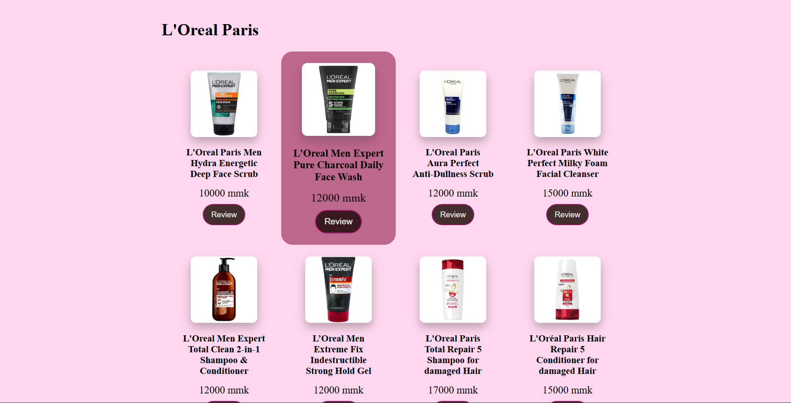

# Cosmétique — Cosmetics Storefront

A multipage cosmetics storefront built with **HTML, CSS, and JavaScript** during Semester I at the University of Information Technology. This was my first web development group project, created for Web Technology (Group 3).

The project brings several beauty brands into one browsable website and demonstrates page design, navigation, product presentation, and a browser-based shopping cart.

**Development:** Cosmétique was developed collaboratively as a group project. Aung Myo Pyae shared development with his teammates.

## Screenshots

## Features

- Homepage with brand promotions and animated text.
- Dedicated content for L’Oréal Paris, Rare Beauty, Vaseline, Romand, and Flower Knows.
- Product and review pages with images and descriptions.
- Catalog with add-to-cart and remove-item interactions and a calculated total in MMK.
- Login, sign-up, contact, and about interfaces.
- Interface effects using Font Awesome, Typed.js, and ScrollReveal.

## How it works

1. A browser loads the HTML page and its linked styles, images, and JavaScript.
2. Navigation links connect the homepage, brand pages, and catalog.
3. On the catalog page, JavaScript responds to product buttons and updates the cart displayed in the page.
4. Cart changes recalculate the displayed total using the selected products and quantities.
5. Reloading the page resets the in-memory cart. Forms demonstrate the interface; they do not create server-side accounts or orders.

All application logic runs in the browser. There is no backend API or database.

## Repository guide

| Path | Purpose |
| --- | --- |
| Main/index.html | Main entry page |
| Main/Js_Home.js | Homepage behavior and interface effects |
| Main/Js_SignUp.js | Sign-up interface behavior |
| Main/Cart/Cart/cart.html | Product catalog and cart page |
| Main/Cart/Cart/cart.js | Cart interaction logic |
| Other_Pages/ | Additional brand and product content |

## Run locally

You need a browser and a static HTTP server. With Python installed, run this command from the repository root:

~~~sh
python -m http.server 8000
~~~

Open **http://localhost:8000/Main/index.html**. The catalog is at **http://localhost:8000/Main/Cart/Cart/cart.html**.

Serve the entire repository root so links to sibling folders and root-relative assets can resolve. Some external fonts or libraries require an Internet connection. Stop the server with Ctrl+C.

## Suggested walkthrough

Open the homepage, navigate through the brand pages, then add several products to the catalog cart. Remove an item and observe the total change. Open the login and sign-up pages to explore the form design.

## Learning focus and limitations

This project introduced HTML structure, CSS styling, DOM events, page navigation, and basic cart calculations. It is a frontend academic prototype: authentication, persistent carts, order submission, and payments are not implemented.

## Credits

Created as a Semester I group project, with Aung Myo Pyae sharing development with his teammates. Student IDs and personal demo contact details are omitted from this public copy. Product names and brand imagery belong to their respective owners and are used here for an educational demonstration.
